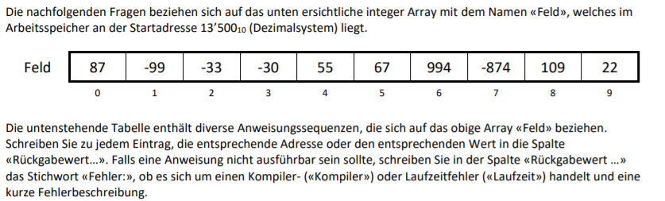

# Aufgabe 5

| Nr. | Feld | Rückgabewert / Fehlerbeschrieb |
|----|---------------------|------------------------------------------------------------------------------------|
| 01 | Feld                | 13'500                                                                             |
| 02 | &Feld[0]            | 87                                                                                 |
| 03 | Feld[0] + Feld      | 87 * 4 Byte + 13'500 = 348 Byte + 13'500 = 13'848 --> Adresse ausserhalb von Array |
| 04 | &Feld[9]            | 13'500 + 9* 4 Byte = 13'536                                                        |
| 05 | Feld[2] + 5         | -33 + 5 = -28                                                                      |
| 06 | Feld[10]            | Fehler: Out of Range (Index ausserhalb v Array)                                    |
| 07 | &Feld[0]            | 13'500                                                                             |
| 08 | &Feld[2 + 5]        | ...                                                                                |
| 09 | 13500[2]            | Out of range                                                                       |
| 10 | Feld[8-3] + Feld[3] | 55 + -30                                                                           |
