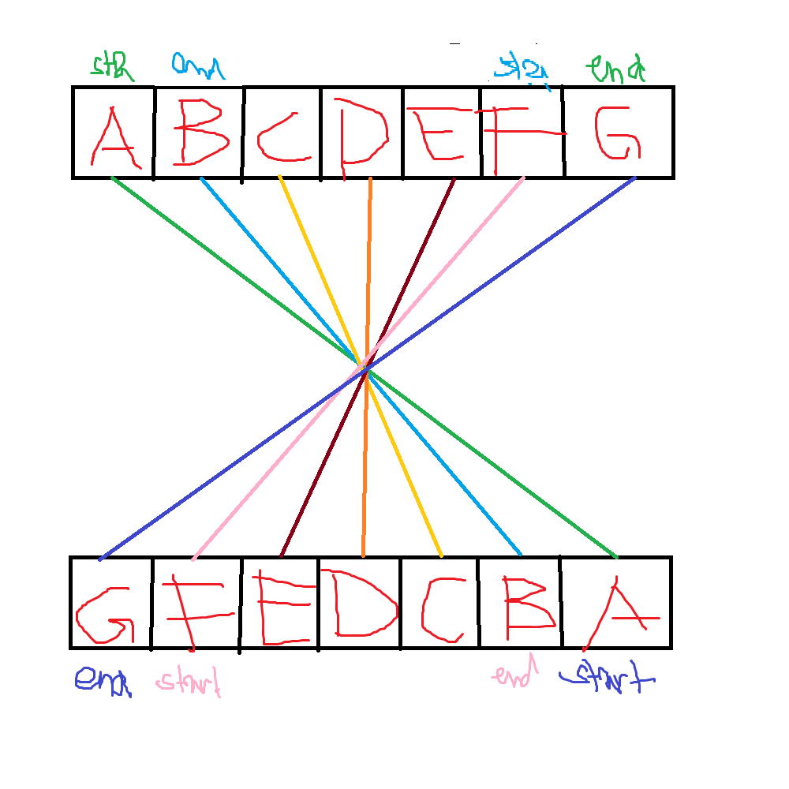

## Aufgabenstellung

## Aufgabe 07: Umgedrehter String
Schreiben Sie ein Programm mit welchem Sie einen String «Text» über die Tastatur eingeben und danach mit Hilfe von
Pointern den String verkehrt (letzter Buchstabe zuerst usw.) ausgeben, d.h. von hinten nach vorne

_Reverse a String by Swapping its start end ..._